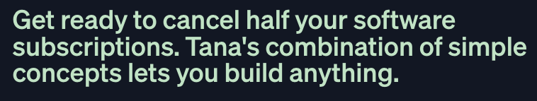
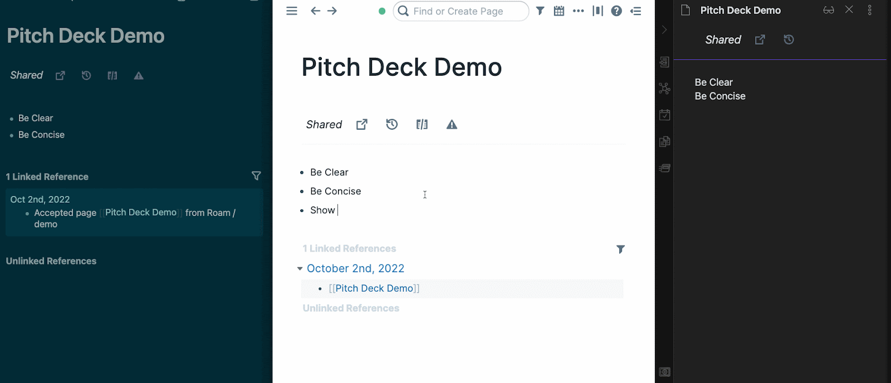

Tools for thought have exploded onto the scene the last three years. [Roam](https://roamresearch.com). [LogSeq](https://logseq.io). [Obsidian](https://obsidian.md). [RemNote](https://remnote.com). [Craft](https://craft.do). Several more are in development waiting to get in on the fun.

And while we continue to innovate on the single player experience, collective sense-making eludes the industry. The reason? Each tool is built with the same philosophy – "If we could just convince everyone to come to our app, _then_ they'll be able to collaborate!" Nothing is more evident of this approach than this copy from [Tana](https://tana.inc)'s landing page:

We expect more tools to adopt this strategy of rebuilding the same importers into their flavor of TFT data model to run on their servers to interact with their UI. But at SamePage, we believe users want something far simpler. What if their existing tooling could just work better, _together_?

## Enter The Protocol for Thought

We are betting that this growth in tooling options will only continue. User needs and preferences are very specific. We invest _hundreds of hours_ optimizing the systems within our tools in order to augment our thinking and get things done. This investment comes in the form of building patterns, adding plugins, and importing data from the outside world into our notebooks. The cost to rebuild this investment in another tool is often enough to prevent migrating - losing out on feature improvements other tools are making. Worst of all, it is preventing all of us from actually working with users who have migrated or started using these other tools.

This is why we're building SamePage. We want to bring collaboration _back_ to the tools for thought space. As a Roam user, I want to be able to work with anyone - both without leaving my Roam graph and without subjecting them to have to use Roam as their tool. I want to be able to align with them on what tasks need to be done and what we believe is true, while still having control over how I work.

To start, SamePage focuses on two broad use cases:

- Cross-notebook page sync
- Cross-notebook queries

### Page Sync

Tools like [Figma](https://www.figma.com/) have shown how powerful live collaboration can be. We want to enable the same thing _across applications_. A Roam user should be able to create a page in Roam, connect it to a page in someone's Obsidian vault, and sync changes seamlessly between them as if they were using Google Docs.

Why is "just use Google Docs" insufficient? Because of context. All data we interact with is interrelated, and by working on shared pages within the context of our private notebooks, users will be able to easily share and link to that data.

### Queries

Decentralized teams and organizations could have tasks, notes, and context scattered throughout several tools. Cross-notebook queries will allow users to create centralized views of that data _within their own notebook_. In practice, _where_ the data lives is less important to the user than it being _available_ when they query the question that needs to be answered.

One of the first use cases for queries will be the [Discourse Graph Protocol](https://discoursegraph.com) under development by Joel Chan's research in collaboration with [Protocol Labs](https://protocol.ai). This extensible framework will allow researchers to map their ideas and arguments in a modular, composable graph format. With SamePage as the underlying communication protocol, the nodes that make up the protocol could be queryable regardless of the tool used by the researcher.

### Beyond

These are just the _first_ problems to tackle. We have more ideas of where to go from here that encompass other dimensions of collaboration: publishing and instant messaging just to name a couple.

SamePage solves the collaboration problem in a way that's different from the tools that came before it because it is **not** a tool for thought. It is a _protocol_ for thought.

As an open protocol interfaced via extensions, we make it possible for current and future tools to participate in the network, while giving users an experience that's native to them.

## How to get started

Today, we are opening up our Discord, which you can [join here!](https://discord.gg/UpKAfUvUPd) We are looking for users of Roam, LogSeq, and Obsidian to help us start beta testing our extensions and network.

The network and the extensions that accompany it are still a very early prototype. We expect there to be issues and tons of edge cases we haven't covered yet. Nevertheless, we want to start inviting users into our invite-only beta to help us start catching these edge cases and iterate towards a stable experience.

You can read our [install](https://samepage.network/install) page to see how to get the SamePage extension installed into your tool, and our [docs](https://samepage.network/docs) for how to get started. To receive an invite code, please reach out to us at support@samepage.network or DM us on Discord.

We're excited to be building this network of tools to give control and collaboration back to the users. Will you join us?
